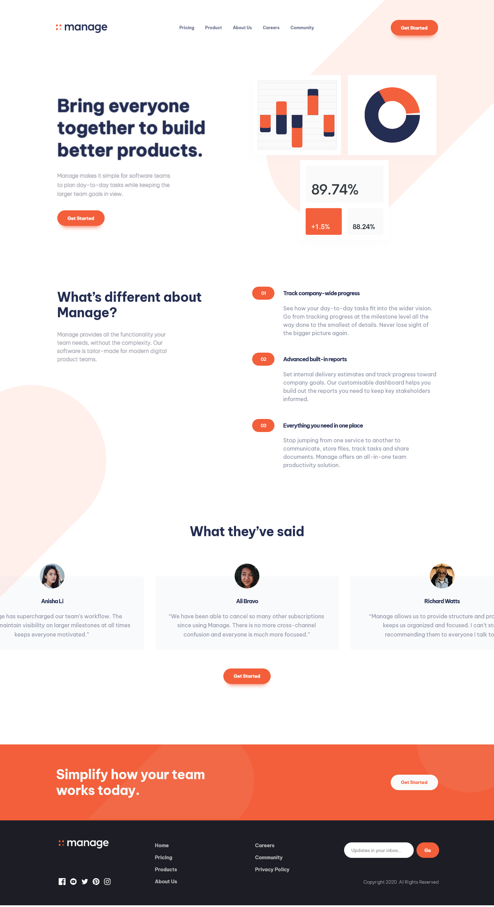

# Frontend Mentor - Manage landing page solution

This is a solution to the [Manage landing page challenge on Frontend Mentor](https://www.frontendmentor.io/challenges/manage-landing-page-SLXqC6P5). Frontend Mentor challenges help you improve your coding skills by building realistic projects.

## Table of contents

- [Overview](#overview)
  - [The challenge](#the-challenge)
  - [Screenshot](#screenshot)
  - [Links](#links)
- [My process](#my-process)
  - [Built with](#built-with)
  - [What I learned](#what-i-learned)
  - [Continued development](#continued-development)
  - [Useful resources](#useful-resources)
- [Author](#author)
- [Acknowledgments](#acknowledgments)

## Overview

### The challenge

Users should be able to:

- View the optimal layout for the site depending on their device's screen size
- See hover states for all interactive elements on the page
- See all testimonials in a horizontal slider
- Receive an error message when the newsletter sign up `form` is submitted if:
  - The `input` field is empty
  - The email address is not formatted correctly

### Screenshot

### Links

- Solution URL: [click here to skip](https://github.com/JoannaLapa/Manage-landing-page-solution)
- Live Site URL: [click here to skip](https://joannalapa.github.io/Manage-landing-page-solution/)

## My process

### Built with

- Semantic HTML5 markup
- SCSS
- Gulp
- Flexbox
- CSS Grid
- Mobile-first workflow

### What I learned

I learnt about accessibility issuses in navigation and slider. I learnt about a11y slider library and used it in my project. I practiced layout skills.

### Continued development

I would like to focus on accessibility issues, Javascript and Vue.js framework.

### Useful resources

- [Accessible hiding](https://a11y-guidelines.orange.com/en/web/components-examples/accessible-hiding/) - This helped me for understanding accessible hiding reasons.
- [Kevin Povell's videos](https://www.youtube.com/playlist?list=PL4-IK0AVhVjNDRHoXGort7sDWcna8cGPA) - This is an amazing video series which helped me finally improve my solution. My approach was to prepare parts of my solutions and after watching Kevin's videos. I improve my solution with some his tips.

## Author

- Frontend Mentor - [@JoannaLapa](https://www.frontendmentor.io/profile/JoannaLapa)
- Github - [@JoannaLapa ](https://github.com/JoannaLapa)

## Acknowledgments

Kevin Povell's videos
A11Y page for accessibility issues
